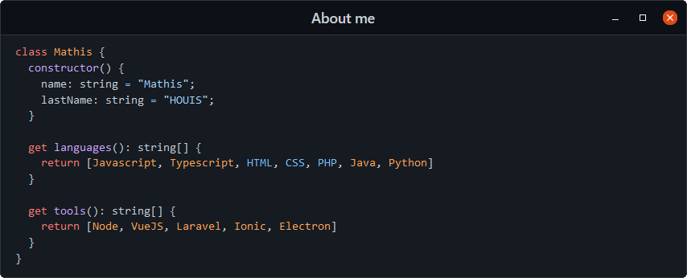

[Column 1](http://149.202.67.36:3000/board/0)
[Column 2](http://149.202.67.36:3000/board/1)
[Column 3](http://149.202.67.36:3000/board/2)
[Column 4](http://149.202.67.36:3000/board/3)
[Column 5](http://149.202.67.36:3000/board/4)
[Column 6](http://149.202.67.36:3000/board/5)
[Column 7](http://149.202.67.36:3000/board/6)
<!-- 
### Hi there 👋

**kozennnn/kozennnn** is a ✨ _special_ ✨ repository because its `README.md` (this file) appears on your GitHub profile.

Here are some ideas to get you started:

- 🔭 I’m currently working on ...
- 🌱 I’m currently learning ...
- 👯 I’m looking to collaborate on ...
- 🤔 I’m looking for help with ...
- 💬 Ask me about ...
- 📫 How to reach me: ...
- 😄 Pronouns: ...
- ⚡ Fun fact: ...
-->
